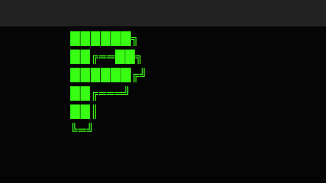

<div align="center">

<h1>Solana Clawd</h1>

<p>
  <strong>Contract:</strong>
  <code>8cHzQHUS2s2h8TzCmfqPKYiM4dSt4roa3n7MyRLApump</code>
</p>

<p>
  <a href="https://solanaclawd.com">solanaclawd.com</a>
  ·
  <a href="https://x402.wtf">x402.wtf</a>
  ·
  <a href="https://github.com/x402agent/solana-clawd">github.com/x402agent/solana-clawd</a>
</p>



</div>
# P Agents

## What is a P Agent?

A P Agent is an autonomous on-chain agent whose identity is a **Metaplex Core asset (NFT)**. It has no private key. Instead, the agent signs transactions via its **Asset Signer PDA** — a program-derived address owned by the Core program. All signed actions flow through Metaplex Core's `Execute` instruction, which acts as a CPI gateway: it verifies the asset authorizes the call and then forwards the inner instruction to the target program.

This means the agent can hold SOL, trade tokens, accrue fees, and delegate authority — all without exposing a secret key.

---

## P Agent Lifecycle

```
Mint Core NFT  →  Register identity  →  Launch P token  →  Trade (buy/sell)  →  Graduate
     ↓                   ↓                    ↓                   ↓                 ↓
  asset PDA        AgentState PDA       BondingCurve PDA     Execute CPI       Raydium pool
```

1. **Mint Core NFT** — The asset address becomes the agent's identity.
2. **Register identity** — Writes `AgentState` on-chain (uri, delegate, active flag).
3. **Launch P token** — Creates a bonding curve + token. Creator fees route to the Asset Signer PDA.
4. **Trade** — Agent buys/sells via Core Execute; signer PDA is the effective buyer/seller.
5. **Graduate** — Once the curve threshold is hit, liquidity migrates to Raydium automatically.

---

## PDA Seeds Table

| PDA | Seeds | Program |
|-----|-------|---------|
| Asset Signer (agent wallet) | `["mpl-core-execute", asset]` | `MPL_CORE_PROGRAM_ID` |
| AgentState | `["agent", signerPda]` | `P_TOKEN_LAUNCHPAD_PROGRAM_ID` |
| BondingCurve | `["bonding-curve", mint]` | `P_TOKEN_LAUNCHPAD_PROGRAM_ID` |
| CurveVault | `["bonding-curve", mint, "vault"]` | `P_TOKEN_LAUNCHPAD_PROGRAM_ID` |
| AgentToken | `["agent-token", mint]` | `P_TOKEN_LAUNCHPAD_PROGRAM_ID` |
| CreatorVault | `["creator-vault", creator]` | `P_TOKEN_LAUNCHPAD_PROGRAM_ID` |
| ExecutionDelegation | `["exec-delegation", agent, delegate]` | `P_TOKEN_LAUNCHPAD_PROGRAM_ID` |
| AgentCollection | `["p-agent-collection", authority]` | `MPL_CORE_PROGRAM_ID` |
| Global config | `["global"]` | `P_TOKEN_LAUNCHPAD_PROGRAM_ID` |

---

## SDK Quick Reference

| Function | What it does |
|----------|-------------|
| `buildMintCoreAsset(payer, config)` | Builds the Metaplex Core `create` instruction for a new agent NFT |
| `deriveAgentCollection(authority)` | Derives the collection PDA for grouping agent NFTs by authority |
| `PAgent.fromAsset(asset, connection)` | Factory — creates a `PAgent` handle for an existing Core asset |
| `agent.signerPda` | Returns the Asset Signer PDA (the agent's keyless wallet) |
| `agent.register(uri)` | Builds `registerAgent` instruction to write AgentState on-chain |
| `agent.launchToken(opts)` | Builds `createAgentToken` instruction wrapped in Core Execute |
| `agent.buy(mint, solIn, minOut)` | Wraps `buildBuy` in Core Execute; agent buys the token |
| `agent.sell(mint, tokensIn, minOut)` | Wraps `buildSell` in Core Execute; agent sells the token |
| `agent.delegateTo(delegate, slot)` | Builds `delegateExecution` so a hot-wallet can act for the agent |
| `wrapAgentExecute(asset, signer, ix)` | Low-level: wraps any instruction in a Core Execute instruction |
| `buildAgentRegistrationDoc(id, opts)` | Builds the ERC-8004 compatible JSON metadata object |
| `fetchAgentRegistration(uri)` | Fetches and validates agent metadata JSON from a URI |
| `validateAgentRegistration(doc)` | Type guard — returns `true` if the object conforms to `AgentRegistration` |

---

## Metaplex Core Execute Pattern

Core Execute is a built-in CPI gateway on the Metaplex Core program. It allows a Core asset to act as an on-chain signer:

```
User tx  →  Core Execute (discriminator 0x0c)
               ├── asset (writable)
               ├── assetSigner PDA (signer)  ← no private key
               ├── target programId
               └── inner instruction accounts
                         ↓
               Target Program (receives the inner ix)
```

The inner instruction data is prefixed with `0x0c` and forwarded verbatim. The `assetSigner PDA` is derived from the asset address, so only the holder of the NFT can authorize these calls — or a registered delegate.

---

## Fee Routing to Asset Signer

When an agent launches a token, it passes its `signerPda` as `creatorFeeWallet` on the bonding curve. All creator fees (basis points set at launch) accumulate in the `CreatorVault` PDA tied to the signer PDA. The agent can later claim them by issuing a `claimCreatorFees` instruction via Core Execute — no private key needed.

---

## ERC-8004 Agent Registration JSON Schema

```json
{
  "@context": "https://erc8004.org/schema/agent.json",
  "@type": "Agent",
  "id": "<asset address>",
  "name": "string",
  "description": "string",
  "image": "string (URI)",
  "model": "string",
  "capabilities": ["string"],
  "endpoint": "string (URI)",
  "services": [{ "name": "string", "endpoint": "string", "version": "string?" }],
  "active": true,
  "registrations": [{ "agentId": "string", "agentRegistry": "string" }],
  "supportedTrust": ["string"]
}
```

The URI stored in `AgentState` on-chain should resolve to this document. Use `buildAgentRegistrationDoc` to produce the object and pin it to Arweave or IPFS before registering.

---

## Devnet vs Mainnet Setup

| Setting | Devnet | Mainnet |
|---------|--------|---------|
| `MPL_CORE_PROGRAM_ID` | `CoREENxT6tW1HoK8ypY1SxRMZTcVPm7R94rH4PZNhX7d` | same |
| `P_TOKEN_LAUNCHPAD_PROGRAM_ID` | set via env after deploying | deployed address |
| RPC endpoint | `https://api.devnet.solana.com` | cluster-specific |
| Airdrop SOL | `solana airdrop 2` | buy on exchange |
| `USE_P_TOKEN` | `"1"` (default) | `"1"` |

Override program IDs via environment variables before constructing any PDA or instruction — the helpers in `shared/src/types.ts` read from `process.env` at module load time.

---

## Comparison: P Agent vs Metaplex Genesis Agent

| Feature | P Agent | Metaplex Genesis Agent |
|---------|---------|----------------------|
| Identity standard | Metaplex Core asset | Metaplex Core asset |
| Signer mechanism | Asset Signer PDA via Core Execute | Asset Signer PDA via Core Execute |
| Token launch | Bonding curve via P Token Launchpad | External AMM or custom program |
| Fee destination | Asset Signer PDA (no private key) | Configurable recipient |
| Delegation | `ExecutionDelegation` PDA with slot expiry | Plugin-based authority model |
