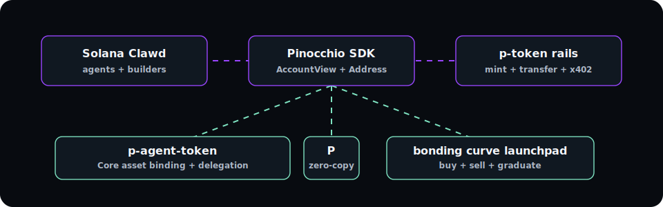
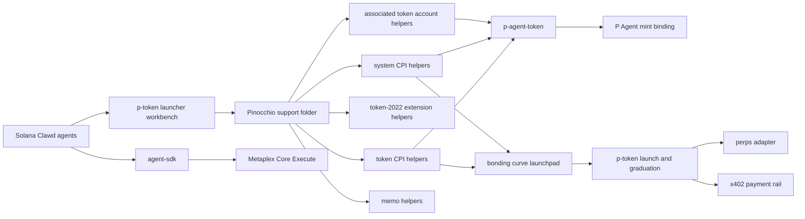

<div align="center">

<h1>Solana Clawd</h1>

<p>
  <strong>Contract:</strong>
  <code>8cHzQHUS2s2h8TzCmfqPKYiM4dSt4roa3n7MyRLApump</code>
</p>

<p>
  <a href="https://solanaclawd.com">solanaclawd.com</a>
  ·
  <a href="https://x402.wtf">x402.wtf</a>
  ·
  <a href="https://github.com/x402agent/solana-clawd">github.com/x402agent/solana-clawd</a>
</p>


</div>

<div align="center">

# Pinocchio and p-token Support




</div>

This repo is the Solana Clawd starting point for developers and agents building optimized native Solana programs with Pinocchio, p-token launch flows, keyless P Agents, bonding curves, x402 payment rails, and perps adapters.

Pinocchio is a zero-dependency, `no_std` Solana program library from Anza that replaces much of the `solana-program` runtime overhead with zero-copy account access. It is useful when compute units and binary size matter more than framework convenience. It is not beginner-focused: developers must own account validation, instruction parsing, serialization, CPI safety, and tests.

Start with the local guide: [pinocchio/USER_GUIDE.md](pinocchio/USER_GUIDE.md).

Solana Clawd uses this codebase for:

- p-token launch workflows, mint inspection, registry exploration, and bonding-curve planning.
- P Agent workflows for faster agent tokens using p-token plus Pinocchio.
- A local p-token/P Agent workbench at [p-token-launcher](p-token-launcher/README.md).
- A low-compute p-memo program at [p-memo-main](p-memo-main/README.md) for launch, agent, and x402 settlement receipts.
- Pinocchio-native drafts for the agent token program and bonding curve launchpad.
- Program templates for vaults, escrow applications, p-token launchers, and p-agent-token flows.
- Agent/MCP-style discovery so local agents can inspect templates, explain tradeoffs, and register launched p-tokens.
- x402 p-token payment support through the existing Solana payment rail.

## Quick Start

Read the full local guide:

```bash
open pinocchio/USER_GUIDE.md
```

Start the unsigned exploration workbench:

```bash
npm run ptoken:launcher
```

Then open:

```txt
http://localhost:8787
```

Use the workbench API directly:

```bash
curl -s http://localhost:8787/api/pinocchio
curl -s http://localhost:8787/api/workspace
curl -s http://localhost:8787/api/program-draft \
  -H 'content-type: application/json' \
  -d '{"target":"devnet"}'
curl -s http://localhost:8787/api/launch-plan \
  -H 'content-type: application/json' \
  -d '{"symbol":"CLAWD","name":"Solana Clawd p-token","virtualSol":30,"virtualToken":1073000000}'
curl -s http://localhost:8787/api/agent-plan \
  -H 'content-type: application/json' \
  -d '{"agentName":"Solana Clawd","symbol":"CLAWD"}'
curl -s http://localhost:8787/api/quote \
  -H 'content-type: application/json' \
  -d '{"side":"buy","virtualSol":30,"virtualToken":1073000000,"sol":1,"feeBps":100}'
```

Run the native Pinocchio checks:

```bash
CARGO_TARGET_DIR=/tmp/letterp-p-agent-token-target cargo check --manifest-path p-agent-token/Cargo.toml
CARGO_TARGET_DIR=/tmp/letterp-bonding-curve-target cargo check --manifest-path programs/src/Cargo.toml
npm run memo:build
```

The docs also describe these intended agent/MCP CLI aliases:

```bash
npm run pinocchio:templates
npm run pinocchio:scaffold -- --template vault --name my-vault --out ./programs/my-vault
npm run pinocchio:scaffold -- --template escrow --name my-escrow --out ./programs/my-escrow
npm run ptoken:inspect -- --mint <mint>
npm run ptoken:add -- --mint <mint> --symbol PFOO --name "P Foo" --p-token-program-id <program>
npm run ptoken:list
npm run ptoken:launch-plan -- --symbol PFOO --name "P Foo"
npm run ptoken:curve-quote -- --virtual-sol 30 --virtual-token 1073000000 --sol 1
npm run pagent:plan -- --symbol PCLAWD --name "Clawd Agent Token" --agent-name "Clawd"
npm run pagent:quote -- --virtual-sol 30 --virtual-token 1073000000 --sol 1
npm run programs:map
npm run programs:show -- token-launcher
```

Today, the executable local frontend path is `npm run ptoken:launcher`; the command aliases above are the documented agent/tooling surface this repo is being shaped toward.

## Folder Map

| Path | Purpose |
| --- | --- |
| [pinocchio/USER_GUIDE.md](pinocchio/USER_GUIDE.md) | Complete guide to Pinocchio, p-token, p-agent-token, launchpad, templates, and workbench workflows. |
| [docs/PINOCCHIO_ADAPTATION.md](docs/PINOCCHIO_ADAPTATION.md) | Local Pinocchio crate map and how it is wired into `p-agent-token`, `programs/src`, `launchpad`, and the launcher. |
| [docs/PROGRAM_DRAFT.md](docs/PROGRAM_DRAFT.md) | Devnet/mainnet P Agent program contract, account model, instruction contract, and implementation order. |
| [docs/PROTOCOL.md](docs/PROTOCOL.md) | Bonding-curve math, account layouts, instruction discriminators, PDA seeds, and x402 flow. |
| [docs/P_AGENTS.md](docs/P_AGENTS.md) | P Agent lifecycle, Core Execute flow, PDA table, SDK reference, and fee routing. |
| [pinocchio/docs/PINOCCHIO_GUIDE.md](pinocchio/docs/PINOCCHIO_GUIDE.md) | Practical Pinocchio notes for Solana Clawd developers and agents. |
| [pinocchio/docs/AGENT_WORKFLOWS.md](pinocchio/docs/AGENT_WORKFLOWS.md) | Agent workflows for p-token exploration and template use. |
| [pinocchio/docs/P_TOKEN_LAUNCHES.md](pinocchio/docs/P_TOKEN_LAUNCHES.md) | Unsigned p-token launch planning and bonding curve workflow. |
| [pinocchio/docs/P_AGENT_TOKEN.md](pinocchio/docs/P_AGENT_TOKEN.md) | p-token plus Pinocchio agent token planning and template workflow. |
| [pinocchio/P_TOKEN.md](pinocchio/P_TOKEN.md) | p-token overview and compute-unit notes. |
| [pinocchio/PROGRAMS.md](pinocchio/PROGRAMS.md) | Known Pinocchio and token program references. |
| [pinocchio/PROGRAM_MAP.md](pinocchio/PROGRAM_MAP.md) | One-by-one local adaptation map for each Pinocchio helper program. |
| [pinocchio/AGENT_HELPERS.md](pinocchio/AGENT_HELPERS.md) | Helper patterns for agents and explorer pages. |
| [data/pinocchio-programs.json](data/pinocchio-programs.json) | Machine-readable map of each Pinocchio helper program and how this repo adapts it. |
| [assets/program-map.svg](assets/program-map.svg) | Animated visual map for the Pinocchio program surface. |
| [p-token-launcher](p-token-launcher/README.md) | Browser/API workbench for p-token and P Agent exploration. |
| [p-agent-token](p-agent-token/README.md) | Pinocchio P Agent token program draft. |
| [programs/src](programs/src/Cargo.toml) | Pinocchio bonding curve launchpad program draft. |
| [launchpad](launchpad/README.md) | TypeScript builders and x402-gated launchpad API. |
| [agent-sdk](agent-sdk/README.md) | P Agent SDK, Core Execute wrapper, registration docs, and launchpad client. |
| [facilitator](facilitator/README.md) | x402 verify/settle/supported service. |
| [perps](perps/README.md) | Perps market config adapters for graduated p-tokens. |
| [templates/vault](templates/vault/README.md) | Minimal Pinocchio vault starter. |
| [templates/escrow](templates/escrow/README.md) | Make/take/refund escrow starter. |
| [templates/p-token-launcher](templates/p-token-launcher/README.md) | Forkable p-token launch checklist and config workbench. |
| [templates/p-agent-token](templates/p-agent-token/README.md) | Forkable p-token agent-token starter with one-way binding and identity concepts. |
| [pinocchio/pinocchio-main/programs](pinocchio/pinocchio-main/programs) | Vendored upstream Pinocchio helper program crates mapped one by one. |

## Program Map



| Program | Source | Codebase adaptation |
| --- | --- | --- |
| System Program helpers | [pinocchio-main/programs/system](pinocchio/pinocchio-main/programs/system) | Used by templates and native drafts for account creation, rent funding, PDA-owned state, and SOL movement. |
| SPL Token helpers | [pinocchio-main/programs/token](pinocchio/pinocchio-main/programs/token) | Used for p-token/SPL-compatible mints, token accounts, transfers, mint/burn/close, and x402 p-token rails. |
| Token-2022 helpers | [pinocchio-main/programs/token-2022](pinocchio/pinocchio-main/programs/token-2022) | Reserved for extension-aware launch paths: metadata pointer, transfer fee, transfer hook, pausable, scaled UI amount, and related extensions. |
| Associated Token Account helpers | [pinocchio-main/programs/associated-token-account](pinocchio/pinocchio-main/programs/associated-token-account) | Used when launch, vault, escrow, and agent flows choose ATA creation or ATA validation. |
| Memo helpers | [pinocchio-main/programs/memo](pinocchio/pinocchio-main/programs/memo) | Reserved for optional launch notes, transaction annotations, and agent-readable trace markers. |
| Vault starter | [templates/vault](templates/vault) | Forkable starter for PDA vault state and deposit/withdraw instruction structure. |
| Escrow starter | [templates/escrow](templates/escrow) | Forkable starter for make/take/refund token swap applications. |
| p-token launcher starter | [templates/p-token-launcher](templates/p-token-launcher) | Forkable config contract for launches, bonding curve planning, mint verification, registry updates, and x402 routing. |
| p-agent-token starter | [templates/p-agent-token](templates/p-agent-token) | Forkable p-token agent-token contract shape with agent identity, delegation, bonding curve, and one-way token binding. |

For the upstream helper crate map, see [pinocchio/pinocchio-main/programs](pinocchio/pinocchio-main/programs).

## Development Rules

- Treat p-token and Pinocchio programs as native Solana programs, not Anchor programs.
- Keep account validation in `TryFrom` implementations so instruction `process()` methods stay focused.
- Prefer field-by-field byte parsing unless you have measured and documented a safe zero-copy layout.
- Use `pinocchio-token`, `pinocchio-system`, and `pinocchio-associated-token-account` for CPIs where available.
- Keep TypeScript builders in `launchpad` aligned with native Pinocchio discriminators, account order, and PDA seeds.
- Add Mollusk or SBF tests before deploying or wiring real value.
- Assume generated templates are unaudited until a human review and test suite say otherwise.

## Agent and MCP Integration

The intended p-token and Pinocchio tool surface includes:

- `pinocchio_templates`
- `pinocchio_read_template`
- `ptoken_registry_list`
- `ptoken_inspect`
- `ptoken_registry_add`
- `ptoken_launch_plan`
- `ptoken_bonding_curve_quote`
- `pinocchio_program_map`
- `pinocchio_program`

The local workbench already exposes equivalent JSON routes for the most important exploration flows:

- `GET /api/pinocchio`
- `GET /api/workspace`
- `GET /api/registry`
- `POST /api/explore`
- `POST /api/launch-plan`
- `POST /api/agent-plan`
- `POST /api/program-draft`
- `POST /api/quote`
- `POST /api/inspect`

Agents should prefer these stable surfaces over ad hoc filesystem guesses.

# P Agents

## What is a P Agent?

A P Agent is an autonomous on-chain agent whose identity is a **Metaplex Core asset (NFT)**. It has no private key. Instead, the agent signs transactions via its **Asset Signer PDA** — a program-derived address owned by the Core program. All signed actions flow through Metaplex Core's `Execute` instruction, which acts as a CPI gateway: it verifies the asset authorizes the call and then forwards the inner instruction to the target program.

This means the agent can hold SOL, trade tokens, accrue fees, and delegate authority — all without exposing a secret key.

---

## P Agent Lifecycle

```
Mint Core NFT  →  Register identity  →  Launch P token  →  Trade (buy/sell)  →  Graduate
     ↓                   ↓                    ↓                   ↓                 ↓
  asset PDA        AgentState PDA       BondingCurve PDA     Execute CPI       Raydium pool
```

1. **Mint Core NFT** — The asset address becomes the agent's identity.
2. **Register identity** — Writes `AgentState` on-chain (uri, delegate, active flag).
3. **Launch P token** — Creates a bonding curve + token. Creator fees route to the Asset Signer PDA.
4. **Trade** — Agent buys/sells via Core Execute; signer PDA is the effective buyer/seller.
5. **Graduate** — Once the curve threshold is hit, liquidity migrates to Raydium automatically.

---

## PDA Seeds Table

| PDA | Seeds | Program |
|-----|-------|---------|
| Asset Signer (agent wallet) | `["mpl-core-execute", asset]` | `MPL_CORE_PROGRAM_ID` |
| AgentState | `["agent", signerPda]` | `P_TOKEN_LAUNCHPAD_PROGRAM_ID` |
| BondingCurve | `["bonding-curve", mint]` | `P_TOKEN_LAUNCHPAD_PROGRAM_ID` |
| CurveVault | `["bonding-curve", mint, "vault"]` | `P_TOKEN_LAUNCHPAD_PROGRAM_ID` |
| AgentToken | `["agent-token", mint]` | `P_TOKEN_LAUNCHPAD_PROGRAM_ID` |
| CreatorVault | `["creator-vault", creator]` | `P_TOKEN_LAUNCHPAD_PROGRAM_ID` |
| ExecutionDelegation | `["exec-delegation", agent, delegate]` | `P_TOKEN_LAUNCHPAD_PROGRAM_ID` |
| AgentCollection | `["p-agent-collection", authority]` | `MPL_CORE_PROGRAM_ID` |
| Global config | `["global"]` | `P_TOKEN_LAUNCHPAD_PROGRAM_ID` |

---

## SDK Quick Reference

| Function | What it does |
|----------|-------------|
| `buildMintCoreAsset(payer, config)` | Builds the Metaplex Core `create` instruction for a new agent NFT |
| `deriveAgentCollection(authority)` | Derives the collection PDA for grouping agent NFTs by authority |
| `PAgent.fromAsset(asset, connection)` | Factory — creates a `PAgent` handle for an existing Core asset |
| `agent.signerPda` | Returns the Asset Signer PDA (the agent's keyless wallet) |
| `agent.register(uri)` | Builds `registerAgent` instruction to write AgentState on-chain |
| `agent.launchToken(opts)` | Builds `createAgentToken` instruction wrapped in Core Execute |
| `agent.buy(mint, solIn, minOut)` | Wraps `buildBuy` in Core Execute; agent buys the token |
| `agent.sell(mint, tokensIn, minOut)` | Wraps `buildSell` in Core Execute; agent sells the token |
| `agent.delegateTo(delegate, slot)` | Builds `delegateExecution` so a hot-wallet can act for the agent |
| `wrapAgentExecute(asset, signer, ix)` | Low-level: wraps any instruction in a Core Execute instruction |
| `buildAgentRegistrationDoc(id, opts)` | Builds the ERC-8004 compatible JSON metadata object |
| `fetchAgentRegistration(uri)` | Fetches and validates agent metadata JSON from a URI |
| `validateAgentRegistration(doc)` | Type guard — returns `true` if the object conforms to `AgentRegistration` |

---

## Metaplex Core Execute Pattern

Core Execute is a built-in CPI gateway on the Metaplex Core program. It allows a Core asset to act as an on-chain signer:

```
User tx  →  Core Execute (discriminator 0x0c)
               ├── asset (writable)
               ├── assetSigner PDA (signer)  ← no private key
               ├── target programId
               └── inner instruction accounts
                         ↓
               Target Program (receives the inner ix)
```

The inner instruction data is prefixed with `0x0c` and forwarded verbatim. The `assetSigner PDA` is derived from the asset address, so only the holder of the NFT can authorize these calls — or a registered delegate.

---

## Fee Routing to Asset Signer

When an agent launches a token, it passes its `signerPda` as `creatorFeeWallet` on the bonding curve. All creator fees (basis points set at launch) accumulate in the `CreatorVault` PDA tied to the signer PDA. The agent can later claim them by issuing a `claimCreatorFees` instruction via Core Execute — no private key needed.

---

## ERC-8004 Agent Registration JSON Schema

```json
{
  "@context": "https://erc8004.org/schema/agent.json",
  "@type": "Agent",
  "id": "<asset address>",
  "name": "string",
  "description": "string",
  "image": "string (URI)",
  "model": "string",
  "capabilities": ["string"],
  "endpoint": "string (URI)",
  "services": [{ "name": "string", "endpoint": "string", "version": "string?" }],
  "active": true,
  "registrations": [{ "agentId": "string", "agentRegistry": "string" }],
  "supportedTrust": ["string"]
}
```

The URI stored in `AgentState` on-chain should resolve to this document. Use `buildAgentRegistrationDoc` to produce the object and pin it to Arweave or IPFS before registering.

---

## Devnet vs Mainnet Setup

| Setting | Devnet | Mainnet |
|---------|--------|---------|
| `MPL_CORE_PROGRAM_ID` | `CoREENxT6tW1HoK8ypY1SxRMZTcVPm7R94rH4PZNhX7d` | same |
| `P_TOKEN_LAUNCHPAD_PROGRAM_ID` | set via env after deploying | deployed address |
| RPC endpoint | `https://api.devnet.solana.com` | cluster-specific |
| Airdrop SOL | `solana airdrop 2` | buy on exchange |
| `USE_P_TOKEN` | `"1"` (default) | `"1"` |

Override program IDs via environment variables before constructing any PDA or instruction — the helpers in `shared/src/types.ts` read from `process.env` at module load time.

---

## Comparison: P Agent vs Metaplex Genesis Agent

| Feature | P Agent | Metaplex Genesis Agent |
|---------|---------|----------------------|
| Identity standard | Metaplex Core asset | Metaplex Core asset |
| Signer mechanism | Asset Signer PDA via Core Execute | Asset Signer PDA via Core Execute |
| Token launch | Bonding curve via P Token Launchpad | External AMM or custom program |
| Fee destination | Asset Signer PDA (no private key) | Configurable recipient |
| Delegation | `ExecutionDelegation` PDA with slot expiry | Plugin-based authority model |
